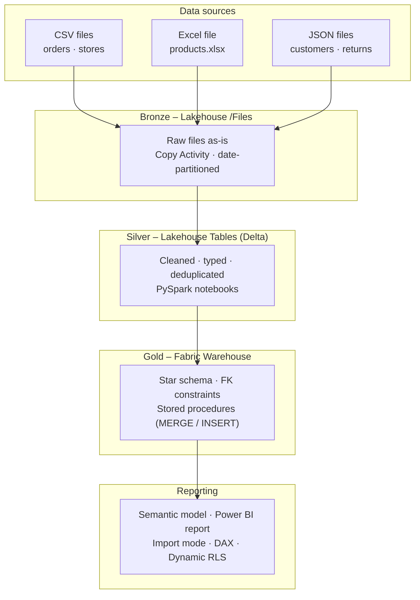
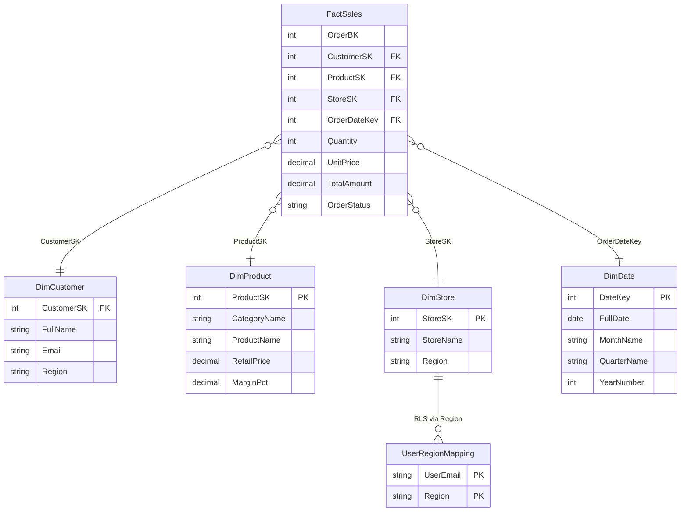
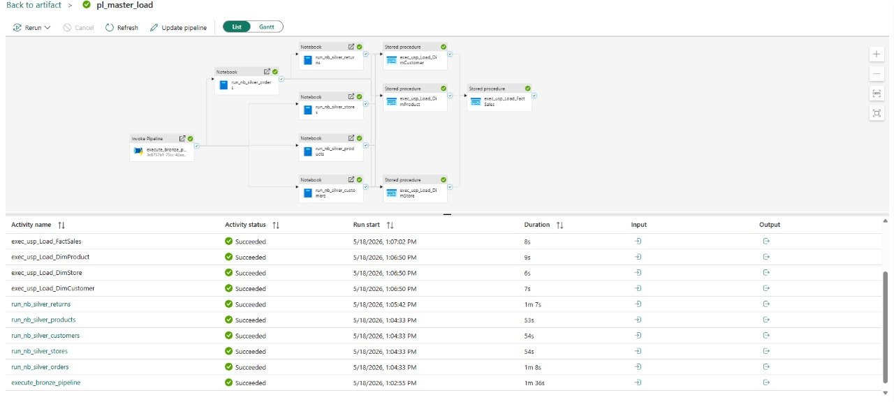
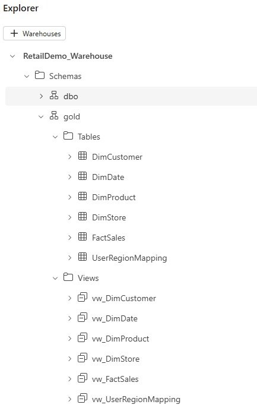
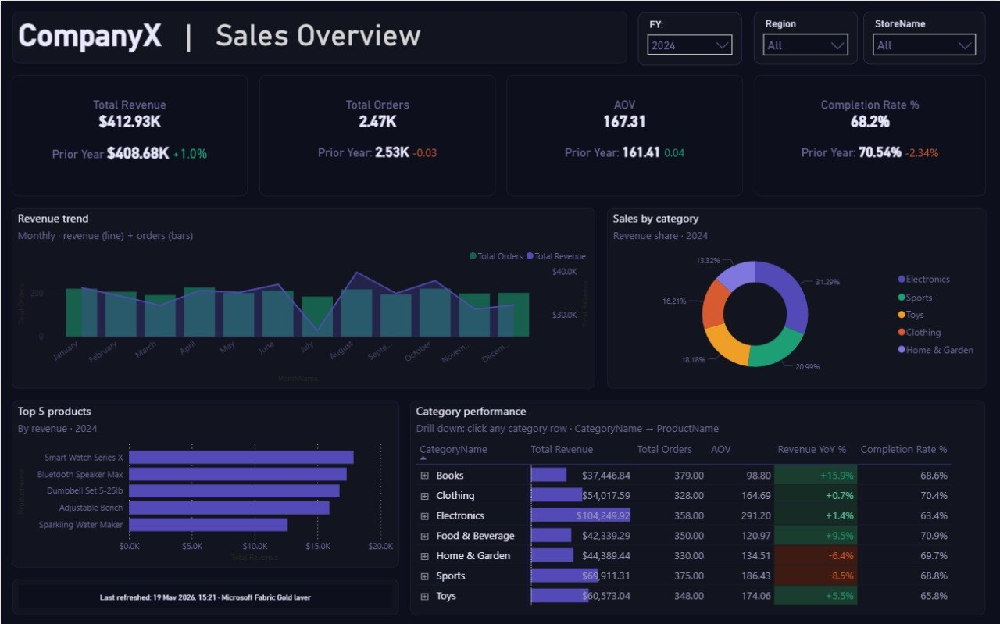
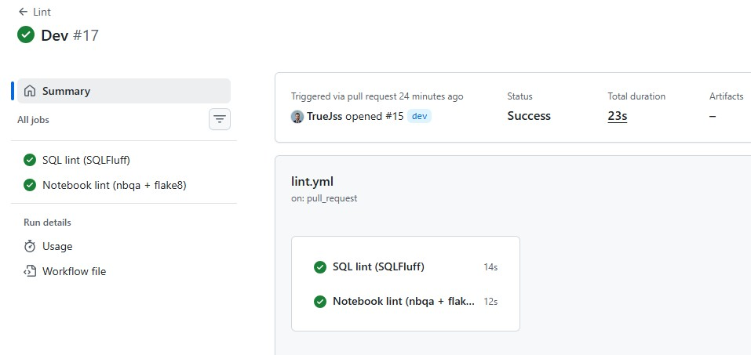

# Microsoft Fabric – Retail Demo


Mock retail data flows through a
medallion pipeline (Bronze → Silver → Gold), lands in a Fabric Warehouse star
schema, and gets served through a Power BI report with row-level security.

---

## Architecture



---

## Tech stack

| Layer | Technology | Detail |
|---|---|---|
| Ingestion | Fabric Data Pipeline | Copy Activity — 5 parallel sources |
| Bronze | Fabric Lakehouse `/Files` | Raw landing zone, date-partitioned |
| Silver | Fabric Lakehouse Tables | Delta format · PySpark notebooks |
| Gold | Fabric Warehouse | T-SQL · MERGE stored procs · FK constraints |
| Semantic model | Power BI Import mode | DAX measures · Dynamic RLS |
| Report | Power BI | Sales overview · drill-down · time intelligence |
| CI/CD | GitHub Actions | SQLFluff · nbqa/flake8 · Fabric REST API sync |
| Mock data | Python · Faker | 5,000 orders · 500 customers · 105 products |

---

## Repository structure

```
fabric-retail-demo/
│
│   # manually maintained
├── fabric/
│   ├── notebooks/                       # PySpark Silver notebooks (.ipynb)
│   │   ├── nb_silver_customers.ipynb
│   │   ├── nb_silver_orders.ipynb
│   │   ├── nb_silver_products.ipynb
│   │   ├── nb_silver_returns.ipynb
│   │   └── nb_silver_stores.ipynb
│   ├── semantic_model/
│   │   └── RetailDemo.SemanticModel/    # TMDL files — tables, relationships, roles
│   │       └── definition/
│   │           ├── tables/
│   │           ├── model.tmdl
│   │           ├── relationships.tmdl
│   │           └── roles.tmdl
│   └── warehouse/
│       ├── ddl/                         # run in order: 00 → 08
│       │   ├── 00_schema.sql
│       │   ├── 01_dim_date.sql
│       │   ├── 02_dim_customer.sql
│       │   ├── 03_dim_product.sql
│       │   ├── 04_dim_store.sql
│       │   ├── 05_fact_sales.sql
│       │   ├── 06_user_region_mapping.sql
│       │   ├── 07_populate_dim_date.sql
│       │   └── 08_views.sql
│       └── stored_procs/
│           ├── usp_Load_DimCustomer.sql
│           ├── usp_Load_DimProduct.sql
│           ├── usp_Load_DimStore.sql
│           └── usp_Load_FactSales.sql
│
├── scripts/
│   └── generate_mock_data.py
├── powerbi/report/
├── docs/screenshots/
├── .github/workflows/
│   ├── lint.yml
│   └── fabric-sync.yml
├── .sqlfluff
├── .flake8
├── .gitignore
└── requirements.txt
│
│   # auto-generated by Fabric Git sync — don't edit these directly
├── fabric_demo.Report/
├── fabric_demo.SemanticModel/
├── nb_silver_*.Notebook/
├── pl_bronze_ingest.DataPipeline.bak/
├── pl_master_load.DataPipeline.bak/
├── RetailDemo_Lakehouse.Lakehouse/
└── RetailDemo_Warehouse.Warehouse/
```

The `fabric/` folder has the source-of-truth files written and reviewed as code.
The root-level Fabric folders are what the workspace sync produces — same content,
different format. Both are committed so the repo can both be reviewed and redeployed.

---

## Data model



---

## Design decisions

**Lakehouse for Bronze/Silver, Warehouse for Gold.** PySpark handles the nested
JSON sources much better than T-SQL would. Once the data is flat and typed in
Silver, it moves to the Warehouse where proper DDL, FK constraints, and indexes
make more sense for a star schema.

**No copy step between Silver and Gold.** The Gold stored procedures query Silver
Delta tables directly using Fabric's three-part naming
(`RetailDemo_Lakehouse.dbo.silver_*`). Moving data just to transform it felt
unnecessary when cross-database queries work fine here.

**Power BI connects to views, not tables.** All `gold.vw_*` views act as a
separation layer. If a column gets renamed or a table gets restructured, the
view absorbs the change and the semantic model doesn't need touching.

**RLS through a mapping table.** The `UserRegionMapping` table maps emails to
regions. The `Regional Sales Manager` role filters `DimStore` using
`USERPRINCIPALNAME()` and an `IN` lookup against that table. Adding or removing
someone's access is just an INSERT or DELETE — no need to republish the model.

**Dependencies are in the pipeline, not the docs.** Silver notebooks and Gold
stored procedures have ordering requirements (returns depend on orders, the fact
load depends on all dims). Rather than documenting this and hoping people read it,
the `dependsOn` constraints in `pl_master_load` enforce the order automatically.

---

## Screenshots

### Master pipeline run


### Gold Warehouse schema


### Power BI dashboard


### GitHub Actions — lint passing


---

## How to reproduce

### Prerequisites

- Microsoft Fabric capacity (F2+ or trial)
- Python 3.11+

### Step 1 — generate mock data

```bash
pip install -r requirements.txt
python scripts/generate_mock_data.py
```

Outputs `orders.csv`, `stores.csv`, `products.xlsx`, `customers.json`,
`returns.json` into `data/mock/`.

### Step 2 — workspace setup

1. Create a Fabric workspace with Git integration pointing to your fork
   (`dev` → dev workspace, `main` → prod workspace)
2. Create a Lakehouse named `RetailDemo_Lakehouse`
3. Create a Warehouse named `RetailDemo_Warehouse`
4. Upload the `data/mock/` files to `Lakehouse/Files/raw_upload/`

### Step 3 — run DDL

In the Fabric Warehouse SQL editor, run the scripts in `fabric/warehouse/ddl/`
in numbered order (00 through 08), then create the stored procedures from
`fabric/warehouse/stored_procs/`.

### Step 4 — run the pipeline

Trigger `pl_master_load` from the Fabric UI. Runs Bronze ingestion, all five
Silver notebooks, and all four Gold stored procedures. Takes around 5–8 minutes,
most of which is Spark cold start.

### Step 5 — connect Power BI

Open Power BI Desktop, connect to the Warehouse SQL endpoint, and import the
`gold.vw_*` views. The TMDL files in
`fabric/semantic_model/RetailDemo.SemanticModel/definition/` have the
relationships, measures, and RLS role for reference.

### Step 6 — assign RLS roles

In the Power BI service, go to the semantic model → **Security** and add users
to the `Regional Sales Manager` role. Sample emails are in
`fabric/warehouse/ddl/06_user_region_mapping.sql`.

---

## CI/CD

PRs to `main` or `dev` run two checks:

- **SQL lint** — SQLFluff on all `.sql` files in `fabric/warehouse/` using the
  `tsql` dialect. PascalCase and column alignment rules are disabled; see
  `.sqlfluff` for the reasoning.
- **Notebook lint** — `nbqa flake8` on all `.ipynb` files in `fabric/notebooks/`.
  `E402` (import order) is ignored since notebook cells don't follow module rules.

Merging to `main` triggers `fabric-sync.yml`, which calls the Fabric REST API
to sync the production workspace. Needs four secrets configured in the repo:

| Secret | Value |
|---|---|
| `FABRIC_TENANT_ID` | Azure AD tenant ID |
| `FABRIC_CLIENT_ID` | Service principal client ID |
| `FABRIC_CLIENT_SECRET` | Service principal secret |
| `FABRIC_WORKSPACE_ID_PROD` | Production workspace GUID |
