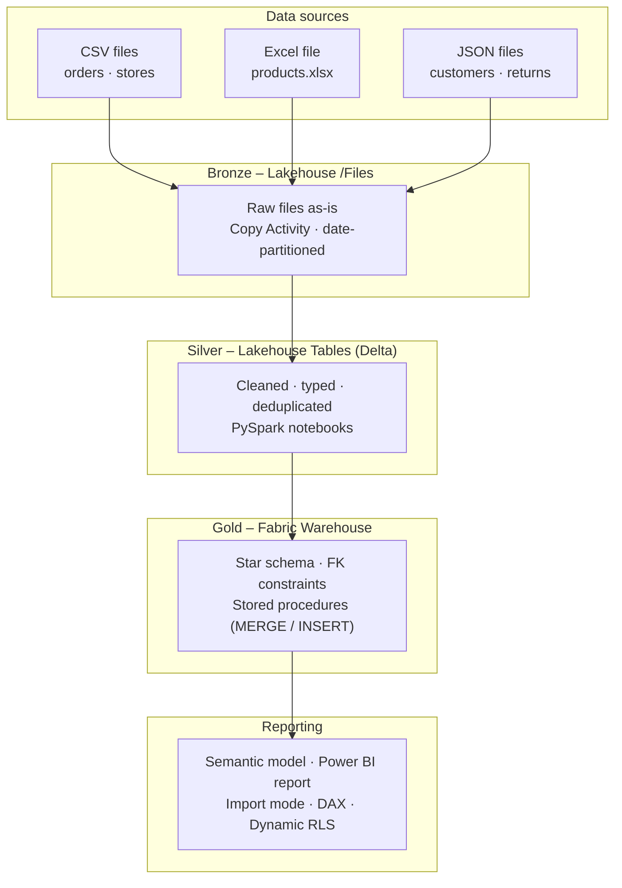
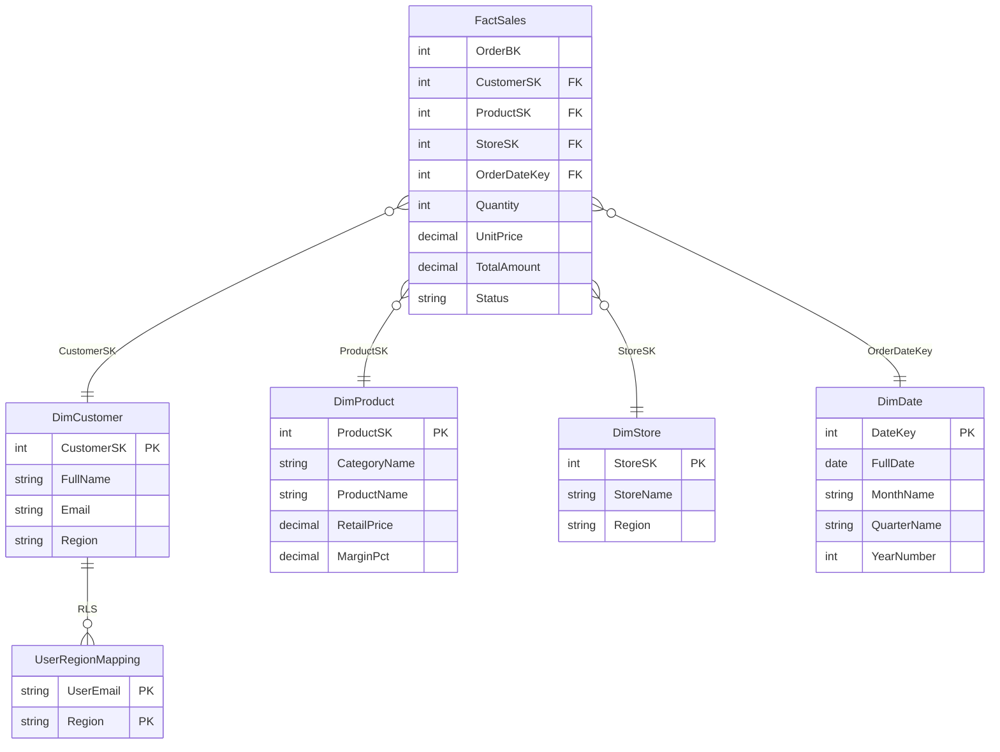

# Microsoft Fabric – Retail Demo


End-to-end data engineering solution built on **Microsoft Fabric** — medallion
architecture (Bronze → Silver → Gold), a T-SQL star schema in Fabric Warehouse,
and a Power BI report with dynamic Row-Level Security.

---

## Architecture



---

## Tech stack

| Layer | Technology | Detail |
|---|---|---|
| Ingestion | Fabric Data Pipeline | Copy Activity — 5 parallel sources |
| Bronze | Fabric Lakehouse `/Files` | Raw landing zone, date-partitioned |
| Silver | Fabric Lakehouse Tables | Delta format · PySpark notebooks |
| Gold | Fabric Warehouse | T-SQL · MERGE stored procs · FK constraints |
| Semantic model | Power BI Import mode | DAX measures · Dynamic RLS |
| Report | Power BI | 3 pages · drill-through · time intelligence |
| CI/CD | GitHub Actions | SQLFluff · nbqa/flake8 · Fabric REST API sync |
| Mock data | Python · Faker | 5,000 orders · 500 customers · 105 products |

---

## Repository structure

```
fabric-retail-demo/
├── .github/
│   └── workflows/
│       ├── lint.yml              # SQL + notebook lint on every PR
│       └── fabric-sync.yml       # Sync prod workspace on merge to main
├── data/
│   └── mock/                     # Generated by scripts/generate_mock_data.py
├── fabric/
│   ├── notebooks/                # PySpark Silver notebooks (.ipynb)
│   │   ├── nb_silver_orders.ipynb
│   │   ├── nb_silver_stores.ipynb
│   │   ├── nb_silver_products.ipynb
│   │   ├── nb_silver_customers.ipynb
│   │   └── nb_silver_returns.ipynb
│   ├── pipelines/
│   │   ├── pl_bronze_ingest.DataPipeline/   # 5 parallel Copy Activities
│   │   └── pl_master_load.DataPipeline/     # End-to-end orchestration
│   ├── warehouse/
│   │   ├── ddl/                  # Schema · tables · indexes · views (00–08)
│   │   └── stored_procs/         # MERGE dims + TRUNCATE/INSERT fact
│   └── semantic_model/
│       └── RetailDemo.SemanticModel/        # TMDL: measures · RLS · relationships
├── powerbi/
│   └── report/
│       └── REPORT_DESIGN.md      # Page-by-page visual specification
├── scripts/
│   └── generate_mock_data.py     # Reproducible synthetic data generator
├── .sqlfluff                     # tsql dialect · PascalCase identifiers
├── .flake8                       # Notebook linting config
└── requirements-dev.txt
```

---

## Data model



---

## Key design decisions

**Lakehouse for Bronze/Silver, Warehouse for Gold.** The Lakehouse handles
semi-structured sources (nested JSON in customers and returns) cleanly via
PySpark. The Fabric Warehouse provides full T-SQL DDL, enforced primary keys,
FK metadata, and non-clustered indexes for the star schema layer — the right
tool for each job rather than forcing one engine to do everything.

**Cross-database queries replace data movement.** The Gold stored procedures
read from Silver Delta tables via Fabric's three-part naming convention
(`RetailDemo_Lakehouse.dbo.silver_*`). No ETL copy step exists between Silver
and Gold — the stored procedures are the transformation, not a data movement
layer on top of one.

**Views as the semantic layer.** Power BI connects to `gold.vw_*` views, never
to the raw tables. Adding a column, renaming a field, or changing a data type
requires updating one view — the semantic model and report are unaffected.

**Dynamic RLS via a mapping table.** A single `UserRegionMapping` table drives
the `Regional Sales Manager` role using `USERPRINCIPALNAME()`. Granting or
revoking regional access is a single-row INSERT or DELETE — no semantic model
republish required. A national manager gets multiple rows and sees all regions.

**Pipeline dependency order is structural, not documented.** `nb_silver_returns`
depends on `nb_silver_orders` completing first (it validates order IDs via a
left-anti join). `exec_usp_Load_FactSales` depends on all three dimension procs
completing first (INNER JOIN SK lookups require complete dimension data). These
are expressed as `dependsOn` constraints in the pipeline JSON — not conventions
that someone has to remember.

---

## Screenshots

> Add screenshots after deploying the workspace. Four images tell the whole story.

**1. Fabric workspace overview** — shows all items: Lakehouse, Warehouse, two
pipelines, five notebooks, semantic model.


**2. Silver layer — Lakehouse Tables** — Delta tables with row counts, confirming
the medallion architecture is real and not just described.


**3. Gold layer — Warehouse schema** — Tables section showing the star schema
with constraints and indexes visible.


**4. Power BI report — Regional Performance page** — bar charts collapsed to a
single region when viewed as `north.manager@demo.com`, demonstrating RLS live.


---

## How to reproduce

### Prerequisites

- Microsoft Fabric capacity (F2+ or trial workspace)
- Python 3.11+

### Step 1 — generate mock data

```bash
pip install -r requirements-dev.txt
python scripts/generate_mock_data.py
```

Writes five files to `data/mock/`:
`orders.csv` · `stores.csv` · `products.xlsx` · `customers.json` · `returns.json`

### Step 2 — Fabric workspace setup

1. Create a Fabric workspace and enable Git integration pointing to your fork
   (`dev` branch → dev workspace, `main` branch → prod workspace)
2. Create a Lakehouse named `RetailDemo_Lakehouse`
3. Create a Warehouse named `RetailDemo_Warehouse`
4. Upload `data/mock/` files to `Lakehouse/Files/raw_upload/`

### Step 3 — run DDL scripts

In the Fabric Warehouse SQL editor, run scripts in numbered order:

```
fabric/warehouse/ddl/00_schema.sql          → creates gold schema
fabric/warehouse/ddl/01_dim_date.sql        → DimDate table + indexes
fabric/warehouse/ddl/02_dim_customer.sql    → DimCustomer table + indexes
fabric/warehouse/ddl/03_dim_product.sql     → DimProduct table + indexes
fabric/warehouse/ddl/04_dim_store.sql       → DimStore table + indexes
fabric/warehouse/ddl/05_fact_sales.sql      → FactSales + FK constraints + indexes
fabric/warehouse/ddl/06_user_region_mapping.sql  → RLS mapping table + sample data
fabric/warehouse/ddl/07_populate_dim_date.sql    → generate date spine 2023–2025
fabric/warehouse/ddl/08_views.sql           → gold.vw_* semantic layer views
```

Then create the stored procedures from `fabric/warehouse/stored_procs/`.

### Step 4 — run the master pipeline

Trigger `pl_master_load` from the Fabric UI. It runs Bronze ingestion, all five
Silver notebooks, and all four Gold stored procedures in dependency order.
Expected runtime: 5–8 minutes (Spark session startup dominates).

### Step 5 — build the semantic model

Open Power BI Desktop, connect to the Fabric Warehouse SQL endpoint, and import
the `gold.vw_*` views. Use the TMDL files in `fabric/semantic_model/` as the
reference for relationships, measures, and RLS configuration.

### Step 6 — configure RLS

In the Power BI service, go to the dataset → Security → assign users to the
`Regional Sales Manager` role. Test with the demo accounts defined in
`fabric/warehouse/ddl/06_user_region_mapping.sql`.

---

## CI/CD

Every pull request to `main` or `dev` triggers two lint checks:

**SQL lint** — SQLFluff validates all `.sql` files in `fabric/warehouse/` against
the `tsql` dialect. Enforces uppercase keywords, uppercase functions, and explicit
`AS` aliases. PascalCase identifiers and aligned column formatting are intentionally
excluded — see `.sqlfluff` for documented reasons.

**Notebook lint** — `nbqa flake8` lints all `.ipynb` files in `fabric/notebooks/`.
Import-order violations (`E402`) are excluded because cell-by-cell execution is
legitimate in Jupyter notebooks.

Merging to `main` triggers `fabric-sync.yml`, which acquires a Fabric API token
via a service principal and calls `POST /workspaces/{id}/git/updateFromGit` to
sync the production workspace. Configure these four secrets in your GitHub
repository before enabling the deploy workflow:

| Secret | Value |
|---|---|
| `FABRIC_TENANT_ID` | Azure AD tenant ID |
| `FABRIC_CLIENT_ID` | Service principal client ID |
| `FABRIC_CLIENT_SECRET` | Service principal secret |
| `FABRIC_WORKSPACE_ID_PROD` | Production workspace GUID |
